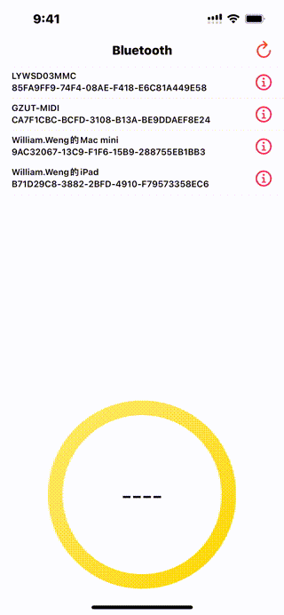

# WWBluetoothManager

[](https://developer.apple.com/swift/) [](https://developer.apple.com/swift/)  [](https://developer.apple.com/swift/) [](https://developer.apple.com/swift/)

Simple integration of official CoreBluetooth suite functions allows developers to develop Bluetooth devices more easily.

簡單整合官方的CoreBluetooth套件功能，讓開發者能更簡單的開發藍牙設備。



### [Installation with Swift Package Manager](https://medium.com/彼得潘的-swift-ios-app-開發問題解答集/使用-spm-安裝第三方套件-xcode-11-新功能-2c4ffcf85b4b)
```
dependencies: [
    .package(url: "https://github.com/William-Weng/WWBluetoothManager.git", .upToNextMajor(from: "1.0.0"))
]
```

### Example
```swift
import CoreBluetooth
import UIKit
import WWPrint
import WWBluetoothManager

final class TableViewDemoController: UIViewController {

    @IBOutlet weak var myTableView: UITableView!
    
    private let myPeripheral = "iOS的MacBook Pro"
    private var isConnent = false
    
    private var peripherals: [CBPeripheral] = [] {
        didSet { myTableView.reloadData() }
    }
    
    override func viewDidLoad() {
        super.viewDidLoad()
        initSetting()
    }
    
    @IBAction func restartScan(_ sender: UIBarButtonItem) {
        WWBluetoothManager.shared.restartScan(delegate: self)
    }
}

// MARK: - UITableViewDelegate, UITableViewDataSource
extension TableViewDemoController: UITableViewDelegate, UITableViewDataSource {
    
    func tableView(_ tableView: UITableView, numberOfRowsInSection section: Int) -> Int {
        return peripherals.count
    }
    
    func tableView(_ tableView: UITableView, cellForRowAt indexPath: IndexPath) -> UITableViewCell {
        return cellMaker(with: tableView, cellForRowAt: indexPath)
    }
    
    func tableView(_ tableView: UITableView, didSelectRowAt indexPath: IndexPath) {
        selectCell(with: tableView, didSelectRowAt: indexPath)
    }
}

// MARK: - WWBluetoothManagerDelegate
extension TableViewDemoController: WWBluetoothManagerDelegate {
        
    func updateState(manager: WWBluetoothManager, state: CBManagerState) {
        updateState(with: manager, state: state)
    }
    
    func discoveredPeripherals(manager: WWBluetoothManager, peripherals: Set<CBPeripheral>, newPeripheralInformation: WWBluetoothManager.PeripheralInformation) {
        discoveredPeripherals(with: manager, peripherals: peripherals, newPeripheralInformation: newPeripheralInformation)
    }
    
    func didConnectPeripheral(manager: WWBluetoothManager, result: Result<UUID, WWBluetoothManager.PeripheralError>) {
        
        switch result {
        case .failure(let error): wwPrint(error)
        case .success(let uuid): wwPrint(uuid)
        }
    }
    
    func didDiscoverPeripheral(manager: WWBluetoothManager, result: Result<WWBluetoothManager.DiscoverValueType, WWBluetoothManager.PeripheralError>) {
        
        switch result {
        case .failure(let error): wwPrint(error)
        case .success(let discoverValueType):
            
            switch discoverValueType {
            case .services(let info): discoverPeripheralServices(with: manager, info: info)
            case .characteristics(let info): discoverPeripheralCharacteristics(with: manager, info: info)
            case .descriptors(let info): discoverPeripheralDescriptors(with: manager, info: info)
            }
        }
    }
    
    func didUpdatePeripheral(manager: WWBluetoothManager, result: Result<WWBluetoothManager.PeripheralValueInformation, WWBluetoothManager.PeripheralError>) {
       
        switch result {
        case .failure(let error): wwPrint(error)
        case .success(let info):
            
            guard let data = info.characteristicValue,
                  !data.isEmpty
            else {
                return
            }
            
            if let number = data._hexString()._UInt64() { title = "\(number)°C"; return }
            if let string = data._string() { title = "\(string)"; return }
        }
    }
    
    func didModifyServices(manager: WWBluetoothManager, information: WWBluetoothManager.ModifyServicesInformation) {
        
        guard let peripheral = manager.peripheral(UUID: information.UUID),
              let index = peripherals.firstIndex(of: peripheral)
        else {
            return
        }
        
        peripherals.remove(at: index)
        myTableView.reloadData()
    }
}

// MARK: - 小工具
private extension TableViewDemoController {
    
    /// 初始化設定
    /// >> info.plist => NSBluetoothAlwaysUsageDescription / NSBluetoothPeripheralUsageDescription
    func initSetting() {
        myTableView.delegate = self
        myTableView.dataSource = self
        WWBluetoothManager.shared.startScan(delegate: self)
    }
    
    /// 產生UITableViewCell
    /// - Parameters:
    ///   - tableView: UITableView
    ///   - indexPath: IndexPath
    /// - Returns: UITableViewCell
    func cellMaker(with tableView: UITableView, cellForRowAt indexPath: IndexPath) -> UITableViewCell {
        
        guard let peripheral = peripherals[safe: indexPath.row] else { fatalError() }
        
        let cell = tableView.dequeueReusableCell(withIdentifier: "MyTableViewCell", for: indexPath)
        let backgroundColor: UIColor
        
        switch peripheral.state {
        case .connecting: backgroundColor = .yellow
        case .connected: backgroundColor = .green
        case .disconnecting: backgroundColor = .lightGray
        case .disconnected: backgroundColor = .white
        default: backgroundColor = .white
        }
        
        cell.textLabel?.text = "\(peripheral.name ?? "<NONE>")"
        cell.detailTextLabel?.text = "\(peripheral.identifier)"
        cell.backgroundColor = backgroundColor
        
        return cell
    }
    
    /// Cell被按到的處理
    /// - Parameters:
    ///   - tableView: UITableView
    ///   - indexPath: IndexPath
    func selectCell(with tableView: UITableView, didSelectRowAt indexPath: IndexPath) {
        guard let peripheral = peripherals[safe: indexPath.row] else { fatalError() }
        WWBluetoothManager.shared.connect(peripheral: peripheral)
        
        if (!isConnent) {
            WWBluetoothManager.shared.connect(peripheral: peripheral)
        } else {
            WWBluetoothManager.shared.disconnect(peripheral: peripheral)
        }
        
        isConnent.toggle()
    }
}

// MARK: - Connect Action
private extension TableViewDemoController {
    
    /// 處理藍牙連線狀態
    /// - Parameters:
    ///   - manager: WWBluetoothManager
    ///   - state: CBManagerState
    func updateState(with manager: WWBluetoothManager, state: CBManagerState) {
        
        switch state {
        case .poweredOn: wwPrint("藍牙已開啟，開始掃描設備")
        case .poweredOff: wwPrint("藍牙已關閉")
        case .resetting, .unauthorized, .unknown, .unsupported: wwPrint("就是這樣 => \(state)")
        @unknown default: break
        }
    }
    
    /// 處理藍牙搜尋到的設備
    /// - Parameters:
    ///   - manager: WWBluetoothManager
    ///   - peripherals: Set<CBPeripheral>
    ///   - newPeripheralInformation: WWBluetoothManager.PeripheralInformation
    func discoveredPeripherals(with manager: WWBluetoothManager, peripherals: Set<CBPeripheral>, newPeripheralInformation: WWBluetoothManager.PeripheralInformation) {
        
        let peripherals = peripherals.compactMap { peripheral -> CBPeripheral? in
            guard peripheral.name == myPeripheral else { return nil }
            return peripheral
        }
        
        self.peripherals = peripherals
    }
}

// MARK: - Discover Peripheral Action
private extension TableViewDemoController {
    
    /// 處理有關搜尋到Services的事務
    /// - Parameters:
    ///   - manager: WWBluetoothManager
    ///   - info: WWBluetoothManager.DiscoverServicesInformation
    func discoverPeripheralServices(with manager: WWBluetoothManager, info: WWBluetoothManager.DiscoverServicesInformation) {
        
        guard let peripheral = manager.peripheral(UUID: info.UUID),
              let services = info.peripheral.services
        else {
            return
        }
        
        services.forEach({ service in
            peripheral.discoverCharacteristics(nil, for: service)
        })
    }
    
    /// 處理有關搜尋到Characteristics的事務
    /// - Parameters:
    ///   - manager: WWBluetoothManager
    ///   - info: WWBluetoothManager.DiscoverCharacteristics
    func discoverPeripheralCharacteristics(with manager: WWBluetoothManager, info: WWBluetoothManager.DiscoverCharacteristics) {
        
        guard let peripheral = manager.peripheral(UUID: info.UUID),
              let service = Optional.some(info.service),
              let characteristics = service.characteristics
        else {
            return
        }
        
        if (service.uuid === .deviceInformation) {
            characteristics.forEach { characteristic in
                if (peripheral._readValue(pairUUIDType: .manufacturerNameString, characteristic: characteristic)) { return }
                if (peripheral._readValue(pairUUIDType: .modelNumberString, characteristic: characteristic)) { return }
            }
        }
        
        if (service.uuid === "0x1809") {
            characteristics.forEach { characteristic in
                if (peripheral._notifyValue(pairUUIDString: "0x2A1E", characteristic: characteristic)) { return }
                if (peripheral._indicateValue(pairUUIDString: "0x2A1C", characteristic: characteristic)) { return }
            }
        }
    }
    
    /// 處理有關搜尋到Descriptors的事務
    /// - Parameters:
    ///   - manager: WWBluetoothManager
    ///   - info: WWBluetoothManager.DiscoverDescriptors
    func discoverPeripheralDescriptors(with manager: WWBluetoothManager, info: WWBluetoothManager.DiscoverDescriptors) {
        wwPrint(info)
    }
}
```
