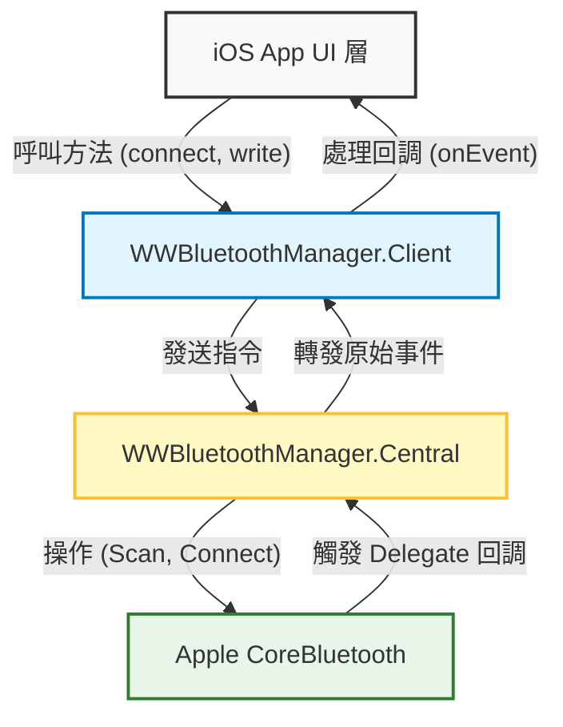

# [WWBluetoothManager](https://swiftpackageindex.com/William-Weng)

[](https://developer.apple.com/swift/)
[](https://developer.apple.com/swift/)

[](https://developer.apple.com/swift/)
[](https://developer.apple.com/swift/)

## 🎉 [相關說明](https://developer.apple.com/documentation/corebluetooth/)
> [`WWBluetoothManager` is a lightweight `CoreBluetooth` wrapper library written in Swift. It simplifies the complex processes of `CBCentralManager` and `CBPeripheralDelegate` by providing a unified delegate interface that delivers clear status updates and automated handling logic.](https://developer.apple.com/documentation/corebluetooth/cbcentralmanager)

> [`WWBluetoothManager` 是一個基於 Swift 的輕量級 `CoreBluetooth` 封裝庫。它簡化了 `CBCentralManager` 與 `CBPeripheralDelegate` 的複雜流程，透過統一的委派介面 (Delegate) 提供清晰的狀態回報與自動化處理邏輯。](https://ithelp.ithome.com.tw/articles/10334018)

## 📷 [效果預覽](https://peterpanswift.github.io/iphone-bezels/)


https://github.com/user-attachments/assets/57755f9d-db9a-4d18-9c00-df17b4141531

https://github.com/user-attachments/assets/566d95ac-028f-47a4-9502-2c92f5300e51

https://github.com/user-attachments/assets/98df3cdf-b434-4a9e-9f73-0f70f5a746bc

<div align="center">

**⭐ 覺得好用就給個 Star 吧！**

</div>

## 💿 [安裝方式](https://medium.com/彼得潘的-swift-ios-app-開發問題解答集/使用-spm-安裝第三方套件-xcode-11-新功能-2c4ffcf85b4b)

使用 **Swift Package Manager (SPM)**：

```swift
dependencies: [
    .package(url: "https://github.com/William-Weng/WWBluetoothManager", .upToNextMinor(from: "1.3.0"))
]
```

## [Central & Peripheral](https://www.youtube.com/watch?v=lkB5iLOm-GE)


## 🧭 [架構圖](https://chiikawa-wallpaper.com/zh-Hant/mobile)


```mermaid
graph TD
    %% 定義風格
    classDef app fill:#f9f9f9,stroke:#333,stroke-width:2px;
    classDef client fill:#e1f5fe,stroke:#0277bd,stroke-width:2px;
    classDef central fill:#fff9c4,stroke:#fbc02d,stroke-width:2px;
    classDef framework fill:#e8f5e9,stroke:#2e7d32,stroke-width:2px;

    %% 節點定義
    AppUI[iOS App UI 層]:::app
    Client[WWBluetoothManager.Client]:::client
    Central[WWBluetoothManager.Central]:::central
    CoreBLE[Apple CoreBluetooth]:::framework

    %% 關係連結
    AppUI -- "呼叫方法 (connect, write)" --> Client
    Client -- "處理回調 (onEvent)" --> AppUI
    
    Client -- "發送指令" --> Central
    Central -- "轉發原始事件" --> Client
    
    Central -- "操作 (Scan, Connect)" --> CoreBLE
    CoreBLE -- "觸發 Delegate 回調" --> Central
```

## 🤝 [委派協定](https://www.youtube.com/watch?v=rlJ1lwZqo9k)

| Delegate 名稱 | 說明 |
|-----------|------|
| `CentralDelegate` | `WWBluetoothManager.Central` 的委派協定，負責接收中央管理器狀態、掃描結果、連線狀態，以及指定 Peripheral 的服務與 characteristic 事件。 |
| `PeripheralDelegate` | `WWBluetoothManager.Peripheral` 的委派協定，負責接收 PeripheralManager 狀態、服務發布、訂閱、寫入請求與 notify 相關事件。 |

## 📬 Delegate 方法

| Delegate 方法 | 說明 |
|-----------|------|
| `centralManager(_ central: Central, status: CentralStatus)` | 接收 CentralManager 事件，例如藍牙狀態更新、掃描結果與連線狀態變化。 |
| `centralManager(_ central: Central, peripheral: CBPeripheral, status: PeripheralStatus)` | 接收指定 Peripheral 的事件，例如服務探索、characteristic 探索、讀寫結果與通知更新。 |
| `peripheralManager(_ peripheral: WWBluetoothManager.Peripheral, status: PeripheralManagerStatus)` | 接收 PeripheralManager 事件，例如狀態更新、Service 新增結果、Central 訂閱、讀寫請求與送出 notify 結果。 |

## 🧲 公開屬性

| Central 參數名稱 | 說明 |
|-----------|------|
| `delegate` | 委派物件，接收所有 CentralManager 和 Peripheral 事件 |
| `state` | 目前 Bluetooth 適配器狀態 |
| `peripherals` | 所有已發現的周邊設備列表（掃描期間累積） |

| Client 參數名稱 | 說明 |
|-----------|------|
| `onEvent` | 用於向外部回報藍牙事件的閉包 |
| `scannedDevices` | 已掃描到的設備列表，以設備 UUID 為鍵值進行快取 |
| `connectedDevice` | 目前已成功連線的設備 |

| Peripheral 屬性名稱 | 說明 |
|-----------|------|
| `delegate` | 委派物件，接收所有 PeripheralManager 相關事件。 |
| `state` | 目前 PeripheralManager 的藍牙狀態。 |
| `controlCharacteristic` | 檔案傳輸控制通道用的 characteristic。 |
| `dataCharacteristic` | 檔案傳輸資料通道用的 characteristic。 |

## 💡 公開 API

| Central API名稱 | 說明 |
|-----------|------|
| `startScan(serviceUUIDs:allowDuplicates:)` | 開始掃描周邊設備 |
| `startScan(serviceUUIDTypes:allowDuplicates:)` | 開始掃描周邊設備 |
| `stopScan()` | 停止掃描 |
| `connect(_:options:)` | 連接到指定周邊設備 |
| `disconnect(_:)` | 斷開指定周邊設備連線 |
| `discoverServices(_:for:)` | 開始發現指定設備的服務 |

| Client API名稱 | 說明 |
|-----------|------|
| `startScan(serviceUUIDs:allowDuplicates:)` | 開始掃描周邊設備 |
| `startScan(serviceUUIDTypes:allowDuplicates:)` | 開始掃描周邊設備 |
| `stopScan()` | 停止掃描 |
| `connect(_:options:)` | 連接到指定周邊設備 |
| `disconnect(_:)` | 斷開指定周邊設備連線 |
| `enableNotify(_:)` | 啟用特定特徵值的通知功能 |
| `disableNotify(_:)` | 停用特定特徵值的通知功能 |
| `write(_:to:type:)` | 將原始資料 (Data) 寫入指定特徵值 |
| `write(_:uuidType:type:)` | 將原始資料 (Data) 寫入指定特徵值 |
| `write(_:to:encoding:type:)` | 將字串 (String) 寫入指定特徵值 |
| `write(_:uuidType:encoding:type:)` | 將字串 (String) 寫入指定特徵值 |

| Peripheral / Accessory API名稱 | 說明 |
|-----------|------|
| `publish(serviceUUID:controlUUID:dataUUID:)` | 建立並發布檔案傳輸用的 Service 與兩條 characteristic |
| `publish(serviceType:controlType:dataType:)` | 建立並發布檔案傳輸用的 Service 與兩條 characteristic |
| `startAdvertising(localName:serviceUUIDs:)` | 開始 BLE 廣播，公開裝置名稱與服務 UUID |
| `startAdvertising(localName:serviceTypes:)` | 開始 BLE 廣播，公開裝置名稱與服務 UUID |
| `stopAdvertising()` | 停止目前的 BLE 廣播 |
| `removeAllServices()` | 移除目前已發布的所有 services，並清空內部參考 |
| `notifyValue(_:for:)` | 對已訂閱的 Central 推送 notify 資料 |
| `peripheralManager(_:status:)` | 接收 Peripheral 狀態事件與 callback |

## 🚀 Central 使用範例

```swift
import UIKit
import CoreBluetooth
import WWBluetoothManager

final class CentralViewController: UIViewController {
    
    private let central = WWBluetoothManager.Central()
    private let targetLocalName = "Control for SB1830"
    
    private var targetPeripheral: CBPeripheral?
    private var writableCharacteristic: CBCharacteristic?
    private var notifyCharacteristic: CBCharacteristic?
    
    override func viewDidLoad() {
        super.viewDidLoad()
        bindBluetooth()
    }
    
    @IBAction func sendHex01(_ sender: UIButton) { sendHex() }
}

extension CentralViewController: WWBluetoothManager.CentralDelegate {
    
    func centralManager(_ central: WWBluetoothManager.Central, status: WWBluetoothManager.CentralStatus) {
        switch status {
        case .stateUpdated(let state): centralStateUpdated(state)
        case .discovered(let result): centralDiscovered(result)
        case .connected(let peripheral): centralConnected(peripheral)
        case .disconnected(let peripheral, let error): centralDisconnected(peripheral, error: error)
        case .failedToConnect(let peripheral, let error): centralFailedToConnect(peripheral, error: error)
        }
    }
    
    func centralManager(_ central: WWBluetoothManager.Central, peripheral: CBPeripheral, status: WWBluetoothManager.PeripheralStatus) {
        switch status {
        case .discoveredServices(let services): discoveredServices(peripheral, services: services)
        case .discoveredCharacteristics(let service, let characteristics): discoveredCharacteristics(peripheral, service: service, characteristics: characteristics)
        case .notificationStateUpdated(let characteristic, let error): notificationStateUpdated(peripheral, characteristic: characteristic, error: error)
        case .characteristicDiscoveryFailed(let service, let error): characteristicDiscoveryFailed(peripheral, service: service, error: error)
        case .characteristicValueUpdated(let characteristic, let data, let error): characteristicValueUpdated(peripheral, characteristic: characteristic, data: data, error: error)
        case .characteristicWriteCompleted(let characteristic, let error): characteristicWriteCompleted(peripheral, characteristic: characteristic, error: error)
        case .serviceDiscoveryFailed(let error): serviceDiscoveryFailed(peripheral, error: error)
        }
    }
}

private extension CentralViewController {
    
    func centralStateUpdated(_ state: CBManagerState) {
        
        print("Bluetooth state => \(state.rawValue)")
        
        guard state == .poweredOn else { return }
        central.startScan()
    }
    
    func centralDiscovered(_ result: WWBluetoothManager.Central.ScanResult) {
        
        guard let displayName = result.displayName,
              displayName == targetLocalName
        else {
            return
        }
        
        print("\(result.jsonString())")
        central.stopScan()
        central.connect(result.peripheral)
    }
    
    func centralConnected(_ peripheral: CBPeripheral) {
        
        targetPeripheral = peripheral
        print("Connected => \(peripheral.name ?? "Unknown")")
    }
    
    func centralDisconnected(_ peripheral: CBPeripheral, error: Error?) {
        
        print("Disconnected => \(peripheral.name ?? "Unknown"), error => \(String(describing: error))")
        
        targetPeripheral = nil
        writableCharacteristic = nil
        notifyCharacteristic = nil
    }
    
    func centralFailedToConnect(_ peripheral: CBPeripheral, error: Error?) {
        print("Failed => \(peripheral.name ?? "Unknown"), error => \(String(describing: error))")
    }
}

private extension CentralViewController {
    
    func discoveredServices(_ peripheral: CBPeripheral, services: [CBService]) {
        
        print("Services of \(peripheral.name ?? "Unknown") (\(services.count) 個):")
        services.forEach { service in print("Service => \(service.uuid.uuidString)") }
    }
    
    func discoveredCharacteristics(_ peripheral: CBPeripheral, service: CBService, characteristics: [CBCharacteristic]) {
        
        print("Characteristics of \(service.uuid.uuidString): (\(characteristics.count) 個)")
        
        characteristics.forEach { characteristic in
            
            let uuidType = WWBluetoothManager.UUIDType.find(uuid: characteristic.uuid)
            
            switch uuidType {
            case .write:    // 找到寫入特性
                writableCharacteristic = characteristic
                print("Writable characteristic found!")

            case .notify:   // 找到通知特性並自動啟用
                notifyCharacteristic = characteristic
                peripheral.setNotifyValue(true, for: characteristic)
                print("Notify enabled!")

            default: break
            }
        }
    }
    
    func serviceDiscoveryFailed(_ peripheral: CBPeripheral, error: Error?) {}
    
    func characteristicDiscoveryFailed(_ peripheral: CBPeripheral, service: CBService, error: Error?) {}
    
    func notificationStateUpdated(_ peripheral: CBPeripheral, characteristic: CBCharacteristic, error: Error?) {
        print("Notification state updated => \(characteristic.uuid.uuidString), isNotifying => \(characteristic.isNotifying), error => \(String(describing: error))")
    }
    
    func characteristicValueUpdated(_ peripheral: CBPeripheral, characteristic: CBCharacteristic, data: Data?, error: Error?) {
        
        print("Value updated => \(characteristic.uuid.uuidString), error => \(String(describing: error))")
        guard let data else { print("  Notify data => nil"); return }
        
        print("Notify hex => \(data.hexString())")
        print("Notify utf8 => \(data.string() ?? "<non-utf8>")")
    }
    
    func characteristicWriteCompleted(_ peripheral: CBPeripheral, characteristic: CBCharacteristic, error: Error?) {
        print("Write completed => \(characteristic.uuid.uuidString), error => \(String(describing: error))")
    }
}

private extension CentralViewController {
    
    func bindBluetooth() {
        central.delegate = self
    }
    
    func sendHex(byte: UInt8 = 0x01) {
        
        guard let peripheral = targetPeripheral else { print("No connected peripheral"); return }
        guard let characteristic = writableCharacteristic else { print("No writable characteristic"); return }
        
        let data = Data([byte])
        let writeType: CBCharacteristicWriteType = characteristic.properties.contains(.writeWithoutResponse) ? .withoutResponse : .withResponse
        
        DispatchQueue.main.asyncAfter(deadline: .now() + 0.5) {
            peripheral.writeValue(data, for: characteristic, type: writeType)
            print("Send hex => \(data.map { String(format: "%02x", $0) }.joined())")
        }
    }
}
```

## 🚀 Client 使用範例

```swift
import UIKit
import CoreBluetooth
import WWBluetoothManager

final class ClientViewController: UIViewController {
    
    @IBOutlet weak var logTextView: LogTextView!
    
    private let client = WWBluetoothManager.Client()
    private let targetLocalName = "Control for SB1830"
        
    override func viewDidLoad() {
        super.viewDidLoad()
        setupBluetooth()
    }
    
    @IBAction func writeData(_ sender: UIBarButtonItem) {
        let result = client.write(Data([0x01]), uuidType: .write, type: .withResponse)
        logTextView.appendLog("\(result)")
    }
}

private extension ClientViewController {
        
    func setupBluetooth() {
        
        client.onEvent = { [weak self] event in
            
            guard let this = self else { return }
            
            Task { @MainActor in
                
                this.logTextView.appendLog("\(event)")
                
                switch event {
                case .discovered(let device): this.connectDevice(device)
                default: break
                }
            }
        }
        
        Task { @MainActor in
            try await Task.sleep(for: .seconds(1.0))
            client.startScan()
        }
    }
}

private extension ClientViewController {
    
    func connectDevice(_ device: WWBluetoothManager.Device) {
        
        guard device.name == targetLocalName else { return }
        
        logTextView.appendLog(device.jsonString ?? "")
        
        Task { @MainActor in
            
            try await Task.sleep(for: .seconds(1.0))
            
            client.connect(device)
            client.stopScan()
        }
    }
}
```
